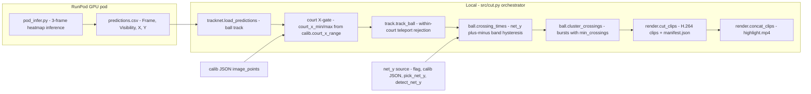

# Architecture Overview

## Design spine: tiers that degrade, not fail

ADR-003 forces every detection tier to be independently shippable: if ball detection fails (low light — ADR-002 says lighting, not frame rate, is the binding capture constraint), the pipeline produces a coarser answer instead of nothing. ADR-004 demoted audio to an optional boundary-refinement signal after the insight that a single omnidirectional mic hears the *whole building* — spatial selectivity is the one property that can't be given up, and only video has it (TECH_SPEC §3 table).

The full v0 spec (TECH_SPEC §3) is a four-tier cascade: **T0′** motion pre-filter (CPU frame-diff in court ROI, skips 30–40% of frames; not built yet) → **T1′** player detection + geometry (primary) → **T2′** ball presence (optional) → optional gated audio → mask inversion → `rallies.json` → render. **`rallies.json` is the contract** between detection and rendering, and the only artifact the [eval harness](../testing/evaluation.md) reads.

## Three detection eras (ADR-039 → 046 → 047) — the most important structural fact

The rally signal has moved twice, each time on measured evidence, and the losers were preserved rather than deleted:

| | v0 — player dead-time inversion | v1-YOLO — sports-ball crossings | v1-TrackNet — heatmap crossings (**primary**) |
|---|---|---|---|
| Signal | Players' court positions & motion | Ball image-y crossing the net line | Same net-crossing signal, better detector |
| ADRs | 026, 028, 037; frozen by 039 | 039, 022; retired by 046 | 046 (retire YOLO), 047 (ball-first primary) |
| Detector | YOLOv8n person, local | yolov8x COCO `sports ball`, local (CoreML option, ADR-044) | TrackNet 3-frame heatmap on RunPod GPU (CUDA-only) |
| Modules | `src/players.py`, `src/events.py` | `archive/yolo_detect.py`, `archive/yolo_pipeline.py` | `scripts/pod_infer.py` → `src/tracknet.py` → `src/cut.py` |
| Status | Frozen baseline; proven as plumbing only (markers inverted on casual play, 2026-08-08) | Archived 2026-08-12: 5 crossings vs TrackNet's 25 on the same rally window | Runnable end-to-end; blocked on one clean fixed-mount clip for real metrics |

ADR-039 froze v0 intact instead of revoking it (the footage that indicted it was zoom-compromised — a confounded test). ADR-046 applied the same rule to YOLO: the 5× crossing-count gap was too large to bridge with tuning, so the YOLO detector moved to `archive/` — recoverable if a local-inference path (fine-tuned yolov8n on Jetson, ADR-040) ever beats TrackNet on clean footage. ADR-047 then settled the direction: **ball-first on the full video is the architecture**, player-tracking is deferred (superseding STRATEGY §3's player-first framing for the near term; v0 stays frozen, not revoked).

All eras converge on the **shared, backend-agnostic spine** in `src/ball.py` + `src/segment.py` + `src/render.py` + `eval/harness.py`. `crossing_times` / `cluster_crossings` / `net_line_y` accept any ball track — YOLO, TrackNet, or synthetic — which is exactly what made the detector swap cheap.

## The active TrackNet chain (runnable today)

*The active pipeline: GPU inference on the pod produces a CSV; everything downstream is local and backend-agnostic.* The net-crossing concept stays identical across detectors — only the track producer changes. Two detector-specific pre-spine stages sit between `load_predictions` and `crossing_times`: the **court X-gate** (drops detections on adjacent courts, gap-independent) and **`track_ball`** (within-court teleport rejection) — added 2026-08-16 after IMG_7744 showed TrackNet's best-guess ball hopping to a neighbouring court and producing phantom rallies the tracker alone couldn't stop (its `reset_after` releases during real dead time). Validated parameters (IMG_7655 full-video run, EXPERIMENTS 2026-08-12): `gap_sec=3.0`, `min_crossings=3`. The operator recipe is in [Key Workflows](../workflows/pipeline.md); the domain reasoning in [Rally Detection Concepts](../concepts/rally-detection.md).

## Why image space for the ball, court space for players

`src/players.py` projects foot points through the calibration homography into court feet, so all player logic is pose-independent (ADR-036: calibration absorbs camera pose, not occlusion; ADR-009: ground-plane projection is valid for feet only). The ball flies *above* the ground plane, so the same homography mis-locates it (parallax). The ball path therefore works in **image space**: from a behind-baseline camera, image-y tells you which side of the net the ball is on. This is the load-bearing geometric decision in `src/ball.py`, and the reason a net line pixel-y — not a full calibration — is the only geometric input the TrackNet path needs (four resolution modes, ADR-041: `--net-y` > `--calib` > interactive picker > Hough auto-detect).

## Selection and rendering (partially wired)

One detection pass feeds two artifacts (ADR-017): `highlights.mp4` (ranked, ≤ 600 s hard budget — `config.yaml` `output.highlight_budget_sec`) and `rallies_full.mp4` (everything). The ranker is deliberately dumb (ADR-019): `score = 0.4·duration + 0.4·n_impacts + 0.2·peak_motion`, greedy knapsack under budget, re-sorted chronologically before render (ADR-020). `src/select.py` is the remaining unbuilt piece — the current `src/cut.py` scores segments by raw crossing count (`score = crossings`) and `src/render.py` cuts padded H.264 clips, writes `manifest.json` keyed by court/session/time, and concatenates `highlight.mp4` from all clips (no budget enforcement yet — the 600 s assert lands with the ranker). The manifest is the seam toward the venue-console direction in `STRATEGY.md`; the production deployment shape is the ADR-043 cloud hybrid (N100 edge cuts full-res locally from cloud-returned timestamps — raw footage never leaves the building).

## Non-functional invariants (TECH_SPEC §10)

- **NFR3 idempotent/resumable** — every stage writes `cache/{stage}/{content_hash}.json` (cache dir exists; discipline applies as stages land).
- **NFR4 deterministic** — same input + config → byte-identical `rallies.json`; the eval loop is meaningless otherwise.
- **NFR7 single command** — the spec shape is `python cut.py session.mp4 --budget 600` (root `cut.py` with capture→detect→select→render). Today's runnable form is two steps: `pod_infer.py` on the pod, then `make process VIDEO=… CSV=… OUT=…` locally (`src/cut.py`). The one-command local form lands with `select.py`.
- **NFR8 hard budget assert** — ffprobe the render; fail rather than emit a non-conforming file. Not yet enforced (no ranker).
- Compute budget target: ≤ 0.5× source duration on a fanless MacBook Air M2. Detection moved off the laptop (RunPod GPU, ~$0.28/hr; proxy-video trick from ADR-043 cuts upload ~8×), so local wall clock is now decode + ffmpeg-cut bound. An RTX 2000 Ada workstation (available 2026-08-12) is the iteration/fine-tuning box. See [Operations](../operations/runbook.md#compute-reality-split-cloud-gpu-for-detection-local-for-the-rest).

## Evolution worth knowing (git history)

The repo grew bottom-up, test-first: eval harness first (Phase 0, "the thing prior art lacks") → calibration hardened to order-independent clicking (ADR-035) → player pipeline (2026-08-06) → real-footage pivot to the ball (2026-08-08/09) → tracker + render (2026-08-11) → wired YOLO pipeline + validated tracker (2026-08-11) → CoreML export + `max_ball_px` FP fix (2026-08-12, ADR-044/045) → TrackNet beat YOLO 25-to-5 on the benchmark rally and the whole detection path swapped to RunPod (2026-08-12/13, ADR-046/047). `DECISIONS.md` is append-only with tier renames recorded in-place; read it when a design choice looks odd — it was probably a measured correction, not an accident.
