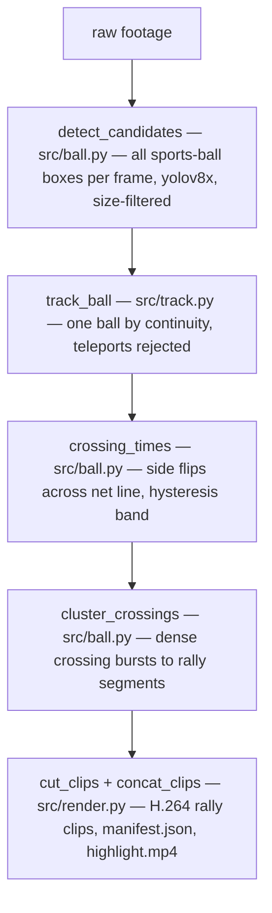

# Architecture Overview

## Design spine: tiers that degrade, not fail

ADR-003 forces every detection tier to be independently shippable: if ball detection fails (low light — ADR-002 says lighting, not frame rate, is the binding capture constraint), the pipeline produces a coarser answer instead of nothing. ADR-004 demoted audio to an optional boundary-refinement signal after the insight that a single omnidirectional mic hears the *whole building* — spatial selectivity is the one property that can't be given up, and only video has it (TECH_SPEC §3 table).

The full v0 spec (TECH_SPEC §3) is a four-tier cascade: **T0′** motion pre-filter (CPU frame-diff in court ROI, skips 30–40% of frames; not built yet) → **T1′** player detection + geometry (primary) → **T2′** ball presence (optional) → optional gated audio → mask inversion → `rallies.json` → render. **`rallies.json` is the contract** between detection and rendering, and the only artifact the [eval harness](../testing/evaluation.md) reads.

## The v0/v1 split (ADR-039) — the most important structural fact

On 2026-08-08 the first real footage showed player-activity markers **inverted** on casual drop-in play: dead time (ball retrieval, walking) registered more active than low-energy dink rallies. Phase 0.6's gate failed. Because the footage was also zoom-compromised (a confounded test), ADR-039 froze v0 intact and added v1 as an additive challenger rather than revoking ADR-026/028:

| | v0 — player dead-time inversion (frozen baseline) | v1 — ball net-crossings (current primary) |
|---|---|---|
| Signal | Players' court positions & motion | Ball's image-y crossing the net line |
| ADRs | 026 (detect dead time, take complement), 028 (player geometry primary), 037 (two-sided markers) | 039 (challenger), 022 (ball presence as signal), 028 (courtesy-return suppression) |
| Modules | `src/players.py`, `src/events.py` | `src/ball.py`, `src/track.py` |
| Status | Proven end-to-end as plumbing only (junk output on compromised footage) | All primitives built + benchmarked; blocked on clean footage |

Both paths converge on the **shared spine**: `src/segment.py` (signal-agnostic gap-tolerant segmenter) → `src/render.py` (H.264 clips + manifest) → `eval/harness.py`. Clean-footage evidence decides primacy — v1 may supersede v0, v0 may win on clean daylight footage, or fusion may beat both.

The v1 chain is **now wired end-to-end** (2026-08-11, EXPERIMENTS): `src/pipeline.py` chains the detection steps and `src/cut.py` orchestrates footage → clips.

The pure core `rally_segments_from_candidates` (candidates in, segments out) is the tested seam; `detect_rallies` adds the YOLO front-end, and `src/cut.py`'s `cut_rallies` attaches the crossing count as each segment's `score` (the interim rank signal until `select.py` lands) and calls the renderer.

The domain reasoning behind each step lives in [Rally Detection Concepts](../concepts/rally-detection.md); the operator recipe is in [Key Workflows](../workflows/pipeline.md).

## Why image space for the ball, court space for players

`src/players.py` projects foot points through the calibration homography into court feet, so all player logic is pose-independent (ADR-036: calibration absorbs camera pose, not occlusion; ADR-009: ground-plane projection is valid for feet only). The ball flies *above* the ground plane, so the same homography mis-locates it (parallax). v1 therefore works in **image space**: from a behind-baseline camera, image-y tells you which side of the net the ball is on. This is the load-bearing geometric decision in `src/ball.py`.

## Selection and rendering (rendering wired, ranking still missing)

One detection pass feeds two artifacts (ADR-017): `highlights.mp4` (ranked, ≤ 600 s hard budget — `config.yaml` `output.highlight_budget_sec`) and `rallies_full.mp4` (everything). The ranker is deliberately dumb (ADR-019): `score = 0.4·duration + 0.4·n_impacts + 0.2·peak_motion`, greedy knapsack under budget, re-sorted chronologically before render (ADR-020). `src/select.py` (the ranker + budget selection) is the remaining Phase 1 back half. The render side is built: `src/render.py` cuts each rally to an H.264 clip, writes a browse `manifest.json` keyed by court/session/time (the seam toward the venue-console direction in `STRATEGY.md`), and `concat_clips` joins all rally clips into a `highlight.mp4` via the ffmpeg concat demuxer. Today `src/cut.py` scores every segment by its raw crossing count and concatenates **all** of them — the ranked/budgeted reel is what `select.py` will add.

## Non-functional invariants (TECH_SPEC §10)

- **NFR3 idempotent/resumable** — every stage writes `cache/{stage}/{content_hash}.json` (cache dir exists; discipline applies as stages land).
- **NFR4 deterministic** — same input + config → byte-identical `rallies.json`; the eval loop is meaningless otherwise.
- **NFR7 single command** — `python cut.py session.mp4 --budget 600` is the spec'd target shape. An orchestrator now exists at **`src/cut.py`** (`python -m src.cut --video ... --calib ... --out ...`, no `--budget` yet); the root-level `cut.py` entry point named by NFR7 / TECH_SPEC §12 is still the intended final shape, so the current location is a deliberate intermediate, not the finished surface.
- **NFR8 hard budget assert** — ffprobe the render; fail rather than emit a non-conforming file (depends on `select.py`'s budget pass; not yet exercised).
- Compute budget target: ≤ 0.5× source duration on a fanless MacBook Air M2; decode and YOLO inference dominate; sampling rate is the cost lever.

## Evolution worth knowing (git history)

The repo grew bottom-up, test-first, in this order: eval harness first (Phase 0, "the thing prior art lacks") → calibration hardened to order-independent clicking (ADR-035) → player pipeline (2026-08-06) → real-footage pivot to the ball (2026-08-08/09: `ball.py` crossing core, auto-annotator, yolov8x + net marking fixes) → tracker + render module → **wiring (2026-08-11): `pipeline.py` chained detect→track→crossing→cluster and validated the tracker on real footage (dead-time crossings 22 → 0, rally kept 16), then `cut.py` closed footage → clips → `highlight.mp4`**. `DECISIONS.md` is append-only with tier renames recorded in-place; read it when a design choice looks odd — it was probably a measured correction, not an accident.
